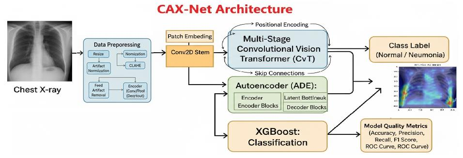

# CAX-NET: A TRANSFORMER-ENSEMBLE FRAMEWORK FOR ROBUST PNEUMONIA DETECTION FROM CHEST X-RAYS

A modular implementation of **CAX-Net** for pneumonia detection using **Convolutional Vision Transformers (CvT)**, **Autoencoder-based Dimensionality Reduction**, and **XGBoost Classification**.

## Architecture



**CAX-Net Processing Pipeline:**

1. **CvT (Vision Transformer)** — extracts **768-dimensional** embeddings from chest X-ray images.
2. **Autoencoder (ADE)** — compresses features from **768 → 64 (latent space)** dimensions.
3. **XGBoost / MxGB** — performs classification based on the reduced embeddings (Pneumonia vs Normal).

### File Structure

```
cax-net/
├── config.py                       # Global configuration settings
├── main.py                         # Unified entry point for training + evaluation
├── train.py                        # Main training pipeline
├── test.py                         # Inference/testing script
├── evaluate.py                     # Evaluation and metrics computation
├── requirements.txt                # Python dependencies

├── data/
│   ├── data_loader.py              # Data loading and preprocessing

├── train_models/
│   ├── train_autoencoder.py        # Autoencoder training
│   ├── train_xgboost.py            # XGBoost training script
│   ├── train_cvt_features.py       # (optional) CvT feature extraction training

├── models/
│   ├── __init__.py
│   ├── cax_models.py               # CvT, Autoencoder, and combined architectures
│   ├── feature_extractor.py        # Vision Transformer / CvT feature utilities
│   ├── cvt_model.pth               # Saved CvT weights
│   ├── autoencoder.pth             # Saved Autoencoder weights
│   ├── xgb_classifier.json         # Base XGBoost model
│   └── scaler.pkl                  # Feature scaling file

├── utils/
│   ├── __init__.py
│   ├── visualize.py                # Visualization and plotting utilities
│   └── save_load.py                # Model saving/loading utilities

├── results/                        # Training and evaluation outputs
│   ├── accuracy.jpg
│   ├── f1_score.jpg
│   ├── confusion_matrix.png
│   ├── confusion_matrix_cvt_ade_xgb.png
│   ├── model_performance_comparison.png
│   ├── performance_metrics.png
│   ├── encoded_dimensions.png
│   ├── encoded_features.png
│   ├── methods_vs_features.png
│   ├── train_vs_val_accuracy.png
│   ├── segmentation_metrics.png
│   └── selected_features.png

└── checkpoints/                    # Saved checkpoints (training states)
```

## Installation

### 1. Clone the Repository

```bash
git clone https://github.com/nakka-thirupathi/cax-net.git
cd cax-net
```

### 2. Create Virtual Environment

```bash
python -m venv .venv
.venv\Scripts\activate  # (Windows)
# or
source .venv/bin/activate  # (Linux/Mac)
```

### 3. Install Dependencies

```bash
pip install -r requirements.txt
```

### 4. Create Required Folders

```bash
mkdir -p models results checkpoints
```

## Usage

### Training

Train the entire pipeline end-to-end:

```bash
python train.py
```

This will:

- Load the Chest X-ray dataset automatically (via Kaggle or local path).
- Extract features using CvT.
- Train Autoencoder for dimensionality reduction.
- Train XGBoost classifier on latent embeddings.
- Save all trained models and performance visualizations.

### Testing / Inference

Run inference on the test split or new data:

```bash
python test.py
```

This will:

- Load models from the `models/` directory.
- Generate predictions and performance metrics.
- Save all visual results under `results/`.

---

## Configuration

Modify `config.py` for your own setup:

```python
class Config:
    IMG_SIZE = 224
    BATCH_SIZE = 32
    LATENT_DIM = 64
    AE_EPOCHS = 50
    DEVICE = 'cuda'  # or 'cpu'
    XGB_PARAMS = {
        'n_estimators': 200,
        'learning_rate': 0.05,
        'max_depth': 6,
        'subsample': 0.8,
        'colsample_bytree': 0.8,
        'objective': 'binary:logistic'
    }
```

## Dataset

1. [Chest X-Ray Pneumonia Dataset (Paul Mooney, Kaggle)](https://www.kaggle.com/datasets/paultimothymooney/chest-xray-pneumonia)
2. [Labeled Chest X-Ray Dataset (Tolgadincer, Kaggle)](https://www.kaggle.com/datasets/tolgadincer/labeled-chest-xray-images)

**Details:**

- Classes: `Pneumonia`, `Normal`
- Automatically downloaded or preloaded
- Train/test split handled in `data_loader.py`

## Extending the Project

### Adding a New Model

In `models/cax_models.py`:

```python
class CustomModel(nn.Module):
    def __init__(self):
        super().__init__()
        # Define custom layers here

    def forward(self, x):
        return x
```

Add a loader:

```python
def load_custom_model(device=Config.DEVICE):
    model = CustomModel().to(device)
    return model
```

---

### Adding Custom Visualizations

In `utils/visualize.py`:

```python
def plot_custom_visualization(data, save_path='results'):
    plt.figure()
    # Custom visualization code
    plt.savefig(os.path.join(save_path, 'custom_plot.png'))
```
